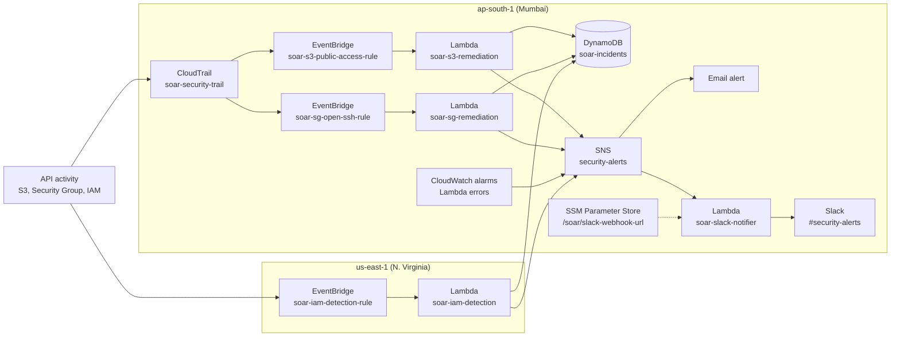

## Architecture

```mermaid
flowchart LR
  A["API activity<br/>S3, Security Group, IAM"] --> CT["CloudTrail<br/>soar-security-trail"]

  subgraph APS1["ap-south-1 (Mumbai)"]
    CT --> EB1["EventBridge<br/>soar-s3-public-access-rule"]
    CT --> EB2["EventBridge<br/>soar-sg-open-ssh-rule"]
    EB1 --> L1["Lambda<br/>soar-s3-remediation"]
    EB2 --> L2["Lambda<br/>soar-sg-remediation"]
    L1 --> DDB[("DynamoDB<br/>soar-incidents")]
    L2 --> DDB
    L1 --> SNS["SNS<br/>security-alerts"]
    L2 --> SNS
    SNS --> Mail["Email alert"]
    SNS --> L4["Lambda<br/>soar-slack-notifier"]
    SSM["SSM Parameter Store<br/>/soar/slack-webhook-url"] -.-> L4
    L4 --> Slack["Slack<br/>#security-alerts"]
    CW["CloudWatch alarms<br/>Lambda errors"] --> SNS
  end

  subgraph USE1["us-east-1 (N. Virginia)"]
    EB3["EventBridge<br/>soar-iam-detection-rule"] --> L3["Lambda<br/>soar-iam-detection"]
  end

  A --> EB3
  L3 --> SNS
  L3 --> DDB
```